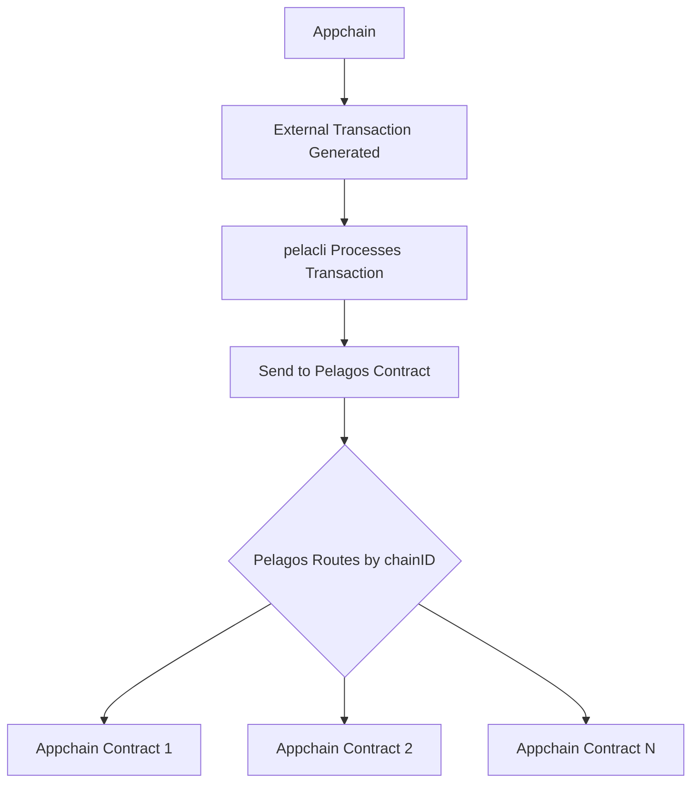

# Atelerix Smart Contracts

> **⚠️ IMPORTANT DISCLAIMER**  
> **These contracts are for DEMONSTRATION and TESTING purposes only.**  
> They are NOT production-ready and should NOT be used in live environments without:
> - Comprehensive security audits
> - Proper access controls and validation
> - Production-grade error handling
> - Gas optimization
> - Thorough testing on testnets
> 
> Use at your own risk. The authors are not responsible for any losses or damages.

This directory contains example smart contracts for the Atelerix SDK, organized by purpose and deployment scenario.

## 📖 Table of Contents

- [📁 Directory Structure](#📁-directory-structure)
- [🚀 Deployment](#🚀-deployment)
  - [Prerequisites](#prerequisites)
  - [Deploy Pelagos & AppChain](#deploy-pelagos--appchain)
  - [Deploy Example](#deploy-example)
- [🔧 Development](#🔧-development)
  - [Build Contracts](#build-contracts)
  - [Test Contracts](#test-contracts)
  - [Clean Build Artifacts](#clean-build-artifacts)
- [🔄 External Transaction Flow](#🔄-external-transaction-flow)

## 📁 Directory Structure

```
contracts/
├── pelacli/             
│   ├── Pelagos.sol         # Main pelagos contract example
│   └── AppChain.sol        # Example appchain contract for external txns
├── example/              
│   └── Example.sol         # Basic bridge & swap demo for example repo
├── scripts/                # Deployment scripts
│   ├── deploy_pelagos.sh   # Deploy Pelagos + AppChain
│   └── deploy_example.sh   # Deploy Example
├── foundry.toml            # Foundry configuration
├── .env.example            # Environment variables template
└── .gitignore              # Ignore build artifacts
```

## 🚀 Deployment

### Prerequisites

1. Install [Foundry](https://book.getfoundry.sh/getting-started/installation):
   ```bash
   curl -L https://foundry.paradigm.xyz | bash
   foundryup
   ```

2. Copy `.env.example` to `.env` and configure:
   ```bash
   cp .env.example .env
   ```

3. Edit `.env` with your configuration:
   ```bash
   RPC_URL=https://eth-sepolia.g.alchemy.com/v2/YOUR_API_KEY # Any EVM-compatible chain RPC
   PRIVATE_KEY=your_private_key_without_0x_prefix
   EXPLORER_API_KEY=YOUR_EXPLORER_API_KEY  # Optional, for verification
   SOURCE_CHAIN_ID=42  # Chain ID for AppChain registration (optional, defaults to 42)
   ```

### Deploy Pelagos & AppChain

**Note:** Developers only need this deployment if they want to test external transactions from their appchain. The deployed Pelagos contract will be part of the pelacli configuration.

The Pelagos deployment script follows this pattern:
1. **Deploy Pelagos** - Main registry contract
2. **Deploy AppChain** - Example appchain contract
3. **Register AppChain** - Register AppChain on Pelagos

This ensures:
- Pelagos is available before AppChain deployment
- AppChain knows the Pelagos address
- AppChain is registered in Pelagos registry
- Registration is verified on-chain

Run from the contracts directory:
```bash
cd scripts
./deploy_pelagos.sh
```

**Output:**
```
🚀 Pelagos & AppChain Deployment
=============================================
📋 Configuration:
RPC URL: https://eth-sepolia.g.alchemy.com/v2/...
Deployer Address: 0x...

📦 Step 1: Deploying Pelagos contract...
✅ Pelagos deployed at: 0x...

📦 Step 2: Deploying AppChain contract...
✅ AppChain deployed at: 0x...

📦 Step 3: Registering AppChain in Pelagos (source chain ID: 42)...
✅ AppChain registered successfully

📦 Step 4: Verifying registration...
✅ Registration verified!

🎉 Deployment Complete!
```

### Deploy Example

**Note:** Developers only need this deployment if they want to process external chain blocks and handle events from the respective deployed chain.

Run from the contracts directory:
```bash
cd scripts
./deploy_example.sh
```

## 🔧 Development

### Build Contracts

```bash
forge build
```

This will compile contracts and create:
- `out/` - Compiled artifacts
- `cache/` - Build cache

**Note:** Unlike `forge script`, using `forge create` in deployment scripts does NOT create a `lib/` directory or install dependencies like `forge-std`.

### Test Contracts

```bash
forge test
```

### Clean Build Artifacts

```bash
forge clean
```

Or manually:
```bash
rm -rf cache/ out/ lib/ foundry.lock
```

## 🔄 External Transaction Flow

The following diagram illustrates how external transactions flow from appchains through the Pelagos system:



**Flow Explanation:**
1. **Appchain** generates an external transaction payload (e.g., token minting request)
2. **Pelacli** processes the transaction from the appchain
3. **Pelacli** sends the processed transaction to the **Pelagos contract**
4. **Pelagos contract** routes the transaction payload to the appropriate **Appchain contract** based on the appchainID
